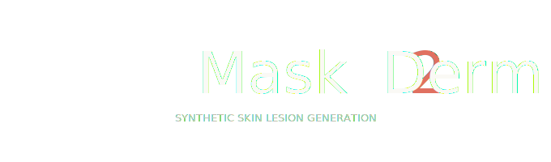
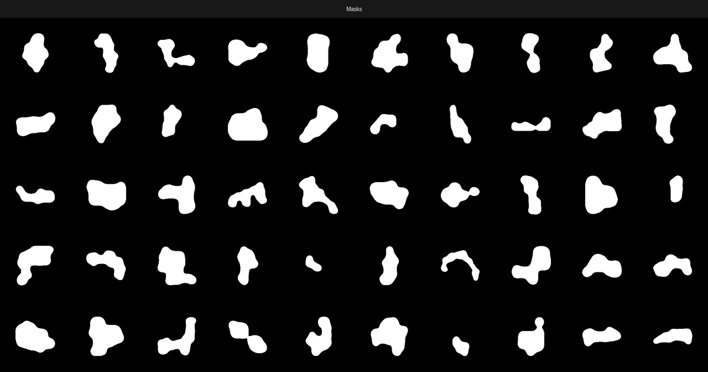
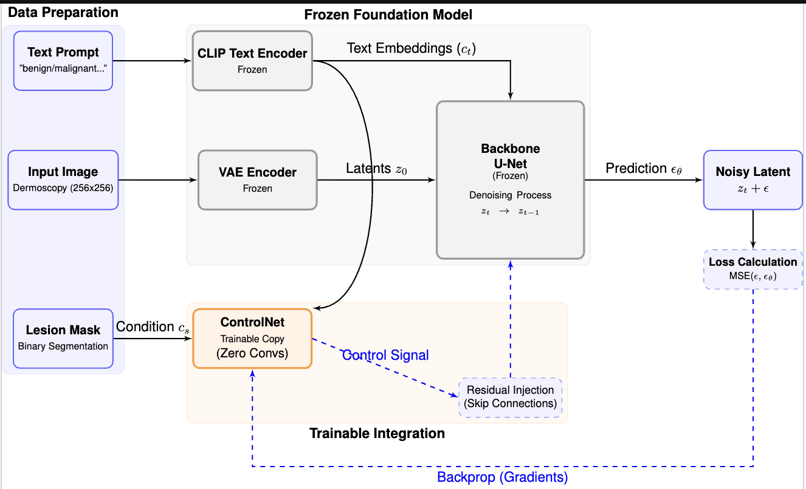

<p align="center" style="background-color: #0f1117; padding: 16px; margin: 0;">
  
</p>


[](https://www.python.org/)
[](LICENSE)

> Can Rollas, Mehmet Kemal Güllü, İbrahim Onur Alıcı
> Amatis IT R&D — IZTECH, İzmir Bakırçay University

---

<p align="center">
  
</p>

---

## Overview

Mask2Derm is a ControlNet-based latent diffusion framework that synthesizes photorealistic dermoscopic images conditioned solely on a binary lesion segmentation mask.

**Key results (HAM10000):**
| Metric | Score |
|---|---|
| Shape consistency — mIoU | 0.866 ± 0.119 |
| Shape consistency — mDice | 0.922 ± 0.096 |
| Distributional alignment — FID (extrapolated) | 62.33 |
| Distributional alignment — KID | 0.07 ± 0.01 |
| TSTR ΔIoU vs ImageNet baseline | **+0.134** |



---

## Architecture

The pipeline has three frozen components (Realistic Vision V5.1 backbone) and one trainable module (ControlNet):

```
Input Mask ──► ControlNet (trainable) ──► residuals ──►
                                                         U-Net (frozen) ──► Denoised Latent ──► VAE Decoder ──► Synthetic Image
Text Prompt ──► CLIP Encoder (frozen) ──► embeddings ──►
```

- **VAE** compresses images to a 32×32 latent space (factor-8 downsampling).
- **U-Net** iteratively denoises in that latent space.
- **ControlNet** injects spatial guidance from the mask via zero-convolution residuals without disturbing the frozen priors.

---

## Setup

```bash
git clone https://github.com/your-org/mask2derm.git
cd mask2derm
pip install -r requirements.txt
```

**HuggingFace access** — the base model requires accepting the license on the Hub:
- [SG161222/Realistic_Vision_V5.1_noVAE](https://huggingface.co/SG161222/Realistic_Vision_V5.1_noVAE)

---

## Data Preparation

### Option A — Download from scratch

```bash
# ISIC 2018 Task 1 (segmentation pairs, ~2600 images)
python data/download.py --download-isic

# HAM10000 (requires Kaggle API key at ~/.kaggle/kaggle.json)
python data/download.py --download-ham

# Merge, resize to 256×256, and write metadata.csv
python data/download.py --prepare --size 256
```

### Option B — Use preprocessed HuggingFace dataset

```python
from datasets import load_dataset
ds = load_dataset("your-hf-org/mask2derm-dataset")
```

### Optics-Inspired Standardization

Every image is passed through a physics-based simulation that models the circular field-of-view, vignetting falloff, and barrel lens distortion of a real dermatoscope:

```python
from data.preprocessing import standardize_pil
from PIL import Image

pil_out = standardize_pil(Image.open("input.jpg"), size=256)
```

Demo comparison (original vs. each stage):

```bash
python data/preprocessing.py --input assets/sample.jpg --output demo.png
```

---

## Training

```bash
# Configure accelerate (first time only)
accelerate config

# Launch training
accelerate launch train.py --config configs/train_config.yaml
```

Key hyperparameters (`configs/train_config.yaml`):

| Parameter | Value |
|---|---|
| Base model | `SG161222/Realistic_Vision_V5.1_noVAE` |
| ControlNet init | `lllyasviel/sd-controlnet-seg` |
| Resolution | 256 × 256 |
| Batch size | 16 (grad. accum. = 4) |
| Learning rate | 1e-5 (cosine, 500 warmup) |
| Optimizer | AdamW (β₁=0.9, β₂=0.999, wd=1e-2) |
| Epochs | 100 |
| Precision | FP32 |

Checkpoints are saved every epoch under `outputs/mask2derm/`.

---

## Inference

```bash
# Single mask → image
python inference.py \
    --controlnet outputs/mask2derm/controlnet-final \
    --mask assets/sample_mask.png \
    --prompt "dermoscopy image of a benign skin lesion, clinical photography" \
    --output generated.png

# Batch: directory of masks → directory of images
python inference.py \
    --controlnet outputs/mask2derm/controlnet-final \
    --mask_dir   data/processed/masks \
    --output_dir outputs/generated \
    --save_grid
```

---

## Evaluation

### Distributional metrics (FID & KID)

```bash
python evaluate/metrics.py \
    --real_dir      data/processed/images \
    --generated_dir outputs/generated
```

FID is computed at four subset sizes and extrapolated to infinite sample size via linear regression to obtain a bias-corrected estimate.

### Shape Consistency (IoU & Dice)

```bash
python evaluate/shape_consistency.py \
    --generated_dir outputs/generated \
    --mask_dir      data/processed/masks \
    --output_csv    results/shape_consistency.csv
```

### TSTR (Train-on-Synthetic, Test-on-Real)

```bash
# 1. Fine-tune DeepLabV3+ on synthetic data
python evaluate/tstr.py train \
    --synthetic_images outputs/generated \
    --synthetic_masks  data/processed/masks \
    --output_dir       outputs/tstr/checkpoints \
    --epochs 50

# 2. Compare against ImageNet baseline on real test set
python evaluate/tstr.py eval \
    --real_images  data/processed/images \
    --real_masks   data/processed/masks \
    --checkpoint   outputs/tstr/checkpoints/best.pth \
    --output_csv   results/tstr_results.csv
```

---

## Repository Structure

```
mask2derm/
├── configs/
│   └── train_config.yaml       # All training hyperparameters
├── data/
│   ├── preprocessing.py        # Optics simulation (vignetting, barrel distortion)
│   ├── dataset.py              # DermoscopyDataset (image, mask, prompt)
│   ├── download.py             # HAM10000 + ISIC 2018 download & preparation
│   └── prepare_hf_dataset.py   # Push to HuggingFace Hub
├── evaluate/
│   ├── metrics.py              # FID extrapolation, KID
│   ├── shape_consistency.py    # IoU / Dice via DeepLabV3+
│   └── tstr.py                 # TSTR experiment
├── utils/
│   └── visualization.py        # Loss curve, IoU histogram, comparison grid
├── train.py                    # Main training script (accelerate)
├── inference.py                # Mask → image generation
├── requirements.txt
└── paper/                      # LaTeX source of the accompanying paper
```

---

## Citation

If you use Mask2Derm in your research, please cite:

```bibtex
@article{rollas2025mask2derm,
  title   = {Mask2Derm: Photorealistic and Controllable Skin Lesion Synthesis via Latent Diffusion},
  author  = {Rollas, Can and G{\"u}ll{\"u}, Mehmet Kemal and Al{\i}c{\i}, {\.I}brahim Onur},
  year    = {2025},
}
```

 